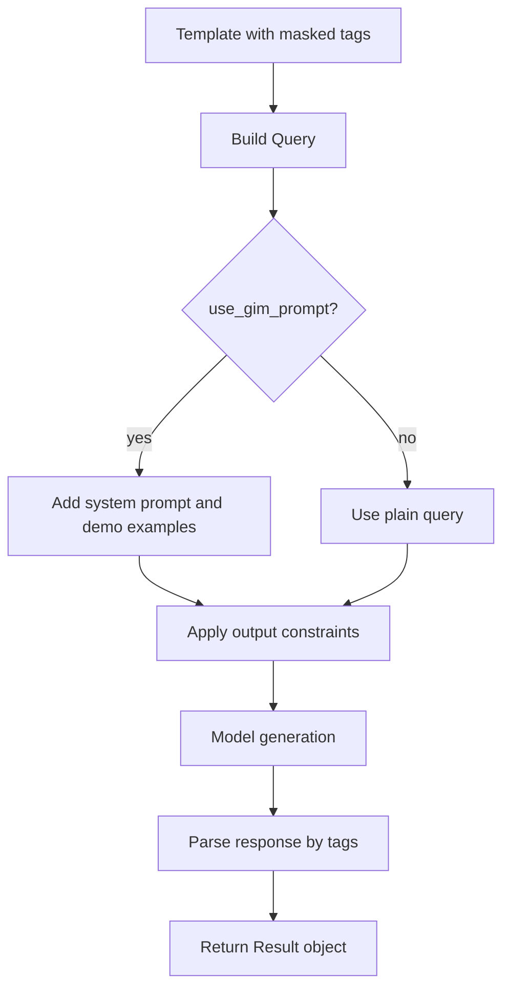

# How GIMKit Works

This page explains the core mechanism behind GIMKit and how to choose runtime options.

## Core Idea

GIMKit turns information extraction into a constrained infilling task:

1. You write a natural-language template.
2. You insert typed masked tags for each field.
3. The model fills only the masked parts.
4. GIMKit infills the generated tag values back into a structured result.

## Main Building Blocks

- `MaskedTag`: placeholder unit with optional name, id, description, regex, and content.
- `Query`: normalized input object built from text plus masked tags.
- `Result`: infilled output with tag-level access (`result.tags["field"]`).
- `guide` helper: convenience constructors for common tags (name, email, date, select, etc.).

## End-to-End Flow

## Prompt Strategy

- GIM-trained local models: usually keep `use_gim_prompt=False`.
- Non-GIM-trained local models: enable `use_gim_prompt=True`.
- OpenAI paths: recommend `use_gim_prompt=True`.

## Output Type Strategy

- OpenAI: prefer `output_type="json"`.
- OpenAI provider without JSON-constrained output: use `output_type=None`.
- vLLM server/offline: prefer `output_type="cfg"` for both GIM-trained and non-trained models.
- Use `output_type="json"` on vLLM when JSON output is explicitly needed.

## Why This Design Works

- Natural-language templates are easy to write and review.
- Typed tags keep output schema explicit.
- Constraints (`cfg`/`json`) improve structure reliability.
- A unified result object keeps downstream code simple.
