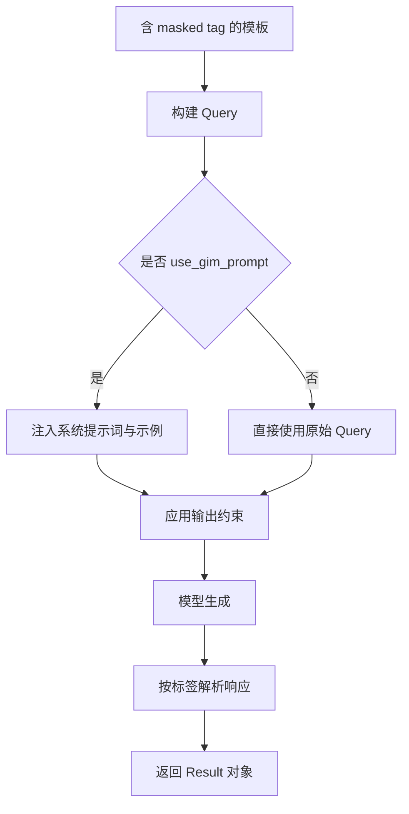

# GIMKit 原理

本页介绍 GIMKit 的核心机制，以及如何选择运行参数。

## 核心思路

GIMKit 将信息抽取转化为“受约束的填空问题”：

1. 用自然语言写模板。
2. 为每个字段插入类型化 masked tag。
3. 模型只填充标签对应内容。
4. GIMKit 将生成内容回填为结构化结果。

## 主要构件

- `MaskedTag`：占位单元，可带 name、id、desc、regex、content。
- `Query`：由模板和标签标准化得到的输入对象。
- `Result`：回填后的输出对象，可按标签名访问（如 `result.tags["field"]`）。
- `guide`：常见标签的快捷构造器（姓名、邮箱、日期、枚举等）。

## 端到端流程

## 提示词策略

- GIM 训练的本地模型：通常保持 `use_gim_prompt=False`。
- 非 GIM 训练的本地模型：建议开启 `use_gim_prompt=True`。
- OpenAI 路径：建议开启 `use_gim_prompt=True`。

## output_type 策略

- OpenAI：优先 `output_type="json"`。
- 若 OpenAI 服务商不支持 JSON 约束输出：使用 `output_type=None`。
- vLLM 服务端/离线：无论 GIM 训练与否，优先 `output_type="cfg"`。
- 当明确需要 JSON 输出时，可在 vLLM 使用 `output_type="json"`。

## 这套设计的价值

- 模板是自然语言，可读性和可维护性高。
- 类型化标签让输出结构可控、可检查。
- 约束模式（`cfg`/`json`）提升结构稳定性。
- 统一的 `Result` 对象让下游处理更简单。
